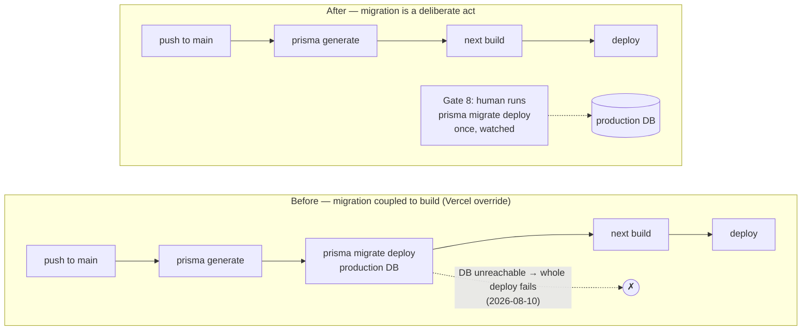
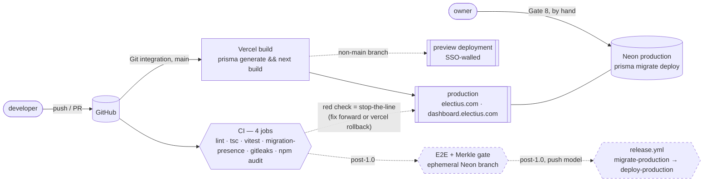

# CI/CD Pipeline — the launch subset, and the design it is the first step of

**Branch:** `feature/ci-pipeline` · **Version:** 0.9.34 (patch, 0.9.x lock)
**Spec:** `context/ci-cd-pipeline/electius-ci-cd-pipeline-spec.md` (design, 2026-08-30) · **Plan reference:** `electius-ci-cd-integration-plan.md` (phases 3–6)
**Date:** 2026-08-30 · **Behaviour change:** none in the app — one workflow file, one Node pin, one script.

> This document is written for the thesis chapter on continuous integration and deployment. It
> describes the pipeline as an instance of the four-stage reference blueprint (Source → Build →
> Test → Release) and its GitOps continuation (pull vs push, promotion, blast radius), mapped onto
> the platform this product actually runs on — Vercel, Neon, GitHub Actions — instead of the
> blueprint's Docker / registry / Kubernetes. Where the mapping is deliberately not one-to-one, it
> says so and why.

## 1. What existed before, and why it was not enough

For 33 released versions every check ran by hand before a merge: `npm run lint`, `npx tsc
--noEmit`, `npm run test`, `npm run build`. That held because one person merged everything — and
it failed once anyway. On 2026-08-02 a cleanup pass found `tsc --noEmit` reporting **57 errors**
while Vitest was green at 407/407: **Vitest strips types without checking them**, so a green suite
is not evidence that the build compiles. There was no pipeline to catch it. `production-readiness-
spec.md` Gate 6 recorded the absence and made it a decision: ship without CI, or ship the smallest
workflow that fails on exactly that class of error.

Two more facts surfaced only when the *deployed* platform was inspected rather than the repo:

1. **Vercel's Build Command was overridden** to `prisma generate && prisma migrate deploy && next
   build` while `package.json` says `prisma generate && next build`. Every push to `main` had been
   running a **production schema migration** as a side effect of a build — no gate, no approval, no
   rollback, thirteen times.
2. On 2026-08-10 the production deploy of `Merge feature/admin-turnout-emails` **failed at that
   step**: `Error: P1001: Can't reach database server`. The application deploy died because the
   database was briefly unreachable at build time. A redeploy three minutes later succeeded. This is
   the textbook reason the reference blueprint runs migrations as a *discrete, ordered step*.



## 2. The reference blueprint, mapped

| Blueprint stage | Reference realisation | Electius realisation | Status |
| --- | --- | --- | --- |
| **Source** | branch protection · pre-commit lint · PR status checks | GitHub Actions on every **push and PR**: `quality` (lint · typecheck · test) · `migration-presence` · `secret-scan` (gitleaks) · `dependency-audit` (`npm audit`) | **shipped — this branch** |
| **Build** | Dockerfile → versioned image · unit tests · coverage floor | **the artifact is the Vercel immutable deployment**; coverage floors on `src/lib` + `src/actions`, 100 % on the trust core | designed (spec §5) |
| **Test** | integration tests against a running stack | Playwright against `next start` in the runner + an **ephemeral Neon branch per run**; the **Merkle re-computation hard gate** | designed (spec §6), post-1.0 |
| **Release** | registry → QA → Staging → Production (manual) | Preview (auto) → Production: **pull model** now, **push model** with two approvals post-1.0 | pull shipped; push designed (spec §7) |
| **GitOps / CD** | config repo · ArgoCD · canary via Argo Rollouts · Prometheus/Grafana | migrations + env definitions as desired state · Vercel as the pull operator · **no canary on the vote path** · instant rollback · `Voter.deliveryFailedAt` as a KPI · provenance in `ElectionSnapshot` | designed (spec §8) |

Two places the mapping is deliberately not one-to-one:

- **No registry.** The blueprint's registry exists so any environment can pull the same artifact. Vercel's deployment store gives the same guarantee — `vercel promote <url>` re-points production at an already-built deployment without rebuilding. A registry would be a second copy of one guarantee.
- **No canary on the voting path.** Traffic splitting means two versions of vote logic count one election. For a voting product that is a correctness violation, not a risk to be tuned; integrity-critical code ships all-or-nothing outside active windows, and *instant rollback* is the control.



## 3. Pull now, push-ready — the two deployment models

| | Pull (launch) | Push (post-1.0) |
| --- | --- | --- |
| Who deploys | Vercel's Git integration on push to `main` | GitHub Actions: `vercel pull` → `vercel build --prod` → `vercel deploy --prebuilt --prod` |
| Credentials in CI | none for deploy | `VERCEL_TOKEN` + the org/project ids |
| Custom gate *before* production changes? | no — the gate is the red check the human sees before merging | yes — freeze check, migration approval, KPI read |
| Migration | by hand (Gate 8) | `migrate-production` job, its own approval, before the deploy job |
| Rollback | Vercel instant rollback | same |
| The switch | — | `vercel.ts` → `git: { deploymentEnabled: false }` + enable `release.yml` |

The push design is written in the spec (§7.2) so switching later is *enabling*, not designing.
On **GitHub Free** a private repo has no protected branches and no Environment reviewers
(verified against GitHub's plan docs), so the release workflow's baseline is `workflow_dispatch`
with typed confirmations (`MIGRATE`, `DEPLOY`); on Pro, two `environment:` lines add required
reviewers and a migration release pauses twice — the second pause naming the schema.

## 4. What shipped

**`.github/workflows/ci.yml`** — the repo's first workflow. Four jobs, no stored secrets (only the auto-provisioned `GITHUB_TOKEN`), ~2–3 min:

| Job | Steps | Why it earns its place |
| --- | --- | --- |
| `quality` | `npm ci` → `npx prisma generate` → `lint` → `typecheck` → `test` | the four hand-run checks, automated; `prisma generate` is explicit because `lint` and `tsc` need the generated client and `build` (which would generate it) is deliberately not run |
| `migration-presence` | diff `BASE..HEAD`; `schema.prisma` changed without `prisma/migrations/` → fail | the only place the *migrations-only* rule can be enforced before a migration runs anywhere |
| `secret-scan` | `gitleaks/gitleaks-action@v3` — on `push` it scans **only the pushed range** (`--first-parent`, so a locally merged `--no-ff` branch is *not* scanned unless the branch was pushed first); on `workflow_dispatch` it scans the **full history**. `.gitleaks.toml` allowlists one known false positive (`key: "voterReminder24h"`, an identifier the entropy rule mistakes for a key — it fired three times in history) | non-negotiable for a repo that holds seven credential sets in gitignored files beside the code. The review found the first draft's "scans the whole history" claim false on this repo's merge-locally workflow; hence the manual trigger and the rule *push the feature branch before merging* |
| `dependency-audit` | `npm audit --audit-level=high` — **`continue-on-error: true` for now** | the cheapest supply-chain signal. On its very first local run it exited 1 with **12 high advisories** (`next` 16.2.9 carries nine, including a middleware/proxy bypass in App Router; `postcss`, `sharp`, `undici`, `prisma`→`deepmerge-ts`). The gate did its job on day one; the fix — `next` → 16.3.3 plus `npm audit fix` — is a framework bump that gets its own `chore/dependency-updates` branch with a full test/build/browser pass, after which the flag comes off. Until then the job stays green and a follow-up step raises a `::warning::` annotation on the run — visible, not blocking, and not a red X people learn to ignore |

Triggers are `push`, `pull_request`, `workflow_dispatch` and a weekly `schedule` (Mondays 03:17
UTC) — every branch, not just `main`. This repo has **zero PRs** in its history (feature branches
are merged locally with `--no-ff` and pushed), so all-branch push is the only way a feature branch
is checked *before* the merge — and it is also why the branch must be **pushed before it is
merged**, or the push-triggered secret scan never sees its commits. The manual and scheduled runs
scan the **full history**; the schedule is the structural backstop for the day the rule is
forgotten (GitHub pauses scheduled workflows after 60 days without repository activity).
`concurrency` cancels a superseded run when pushes come fast; every checkout uses
`persist-credentials: false` because no step pushes; `migration-presence` skips (rather than dies)
when a force-push makes `github.event.before` unreachable, and skips on manual and scheduled runs,
which have no base commit.

**`.gitleaks.toml`** — one allowlist entry, `[[allowlists]]` form, for the wizard option keys in
`step-settings.tsx` that gitleaks' entropy rule mistakes for an API key. It targets the *secret*,
anchored to exactly those five identifiers — the first draft matched whole lines and would have
hidden a real key planted beside one of them (proven with a control). Two facts came out of
running the actual binaries: the action installs **gitleaks 8.24.3** unless told otherwise, and
8.24.3 silently ignores `[[allowlists]]` (history → 3 findings, exit 2), so the workflow pins
`GITLEAKS_VERSION: "8.30.1"` — the version the allowlist was verified against — which also freezes
the ruleset.

**`package.json`** — additive: `"engines": { "node": "24.x" }` and `"typecheck": "tsc --noEmit"`;
`engines` is mirrored into `package-lock.json` so the next unrelated install does not add it as
noise.
The `engines` line is the single Node pin: Vercel reads it (it overrides the project setting),
`actions/setup-node`'s `node-version-file: package.json` reads it (`volta.node` → `devEngines` →
`engines.node`), and any future container reads it. Vercel was already building on 24.x; the
local machine and the earlier plan said 22 — one line ends the drift.

**Deliberately not shipped:** `npm run build` in CI (needs `NEXT_PUBLIC_*`; Vercel builds every
push), Prettier and Husky (CRLF whole-file-rewrite risk; no second developer), `vercel.ts`
(nothing to configure until the push switch), coverage floors (measure first — spec §5), Sentry.

## 5. The manual steps (the app cannot verify any of them)

1. **Vercel → Settings → Build & Development Settings → Build Command: clear the override.** The repo's `prisma generate && next build` then runs. *Verify:* the next deploy's build log line `Running "…"` no longer contains `migrate deploy`.
2. **Vercel → Node.js Version:** leave it; `engines.node` overrides it on the next deploy. *Verify:* the build log.
3. **Local Node 24** (`winget install OpenJS.NodeJS.LTS` or nvm-windows) so dev, CI and production agree. `npm ci` only warns on a mismatch (no `engine-strict`), so this is hygiene, not a blocker.
4. **Production migrations from now on are Gate 8:** `prisma migrate status` against production, then `npm run db:migrate:deploy` with `DIRECT_URL` pointed at production, once, watched, after Gate 7 confirmed point-in-time restore. Nothing automated touches the production schema until the push model lands.
5. **Optional, while GitHub Pro lasts:** Settings → Branches → rule for `main` — require the four checks (they appear in the picker only after their first run), linear history, **no** approval rule (one human + "include administrators" makes `main` unmergeable). Assume the rule stops being enforced the day the plan lapses; it is convenience, not the control.
6. **On the next commit touching `src/app/[locale]/(marketing)/page.tsx`:** delete the unused `PricingPlans` import (the `#pricing` section is commented out, the import is not), then add `--max-warnings=0` to `lint`.
7. **Push every feature branch before `git merge --no-ff`.** The push-triggered secret scan covers only the pushed range along the first parent; a branch merged locally and pushed as a merge commit contributes zero commits to that range. Pushing the branch first is what makes the scan see them.
8. **After the first push, run the workflow once by hand** (GitHub → Actions → CI → *Run workflow*): a `workflow_dispatch` run scans the **full history** — the one-time "the past is clean" evidence, and the run that proves `.gitleaks.toml` works.
9. **`chore/dependency-updates`, promptly:** `next` 16.2.9 → 16.3.3 (nine advisories including a middleware/proxy bypass — in an app whose `proxy.ts` is the auth boundary), `npm audit fix` for the rest, `@types/node` `^20` → `^24`, full `test` + `build` + browser pass, then delete the `continue-on-error` line from `dependency-audit`.

## 6. Verification

| # | Check | Result |
| --- | --- | --- |
| 1 | `ci.yml` parses; exactly four jobs; triggers `push` · `pull_request` · `workflow_dispatch` · `schedule` | ✅ `js-yaml` load |
| 2 | `npm run lint` | ✅ 0 errors, 1 known warning (P9) |
| 3 | `npm run typecheck` | ✅ exit 0 |
| 4 | `npm run test` | ✅ 696 tests / 39 files |
| 5 | `npm audit --audit-level=high` | ⚠ exit 1 — 17 advisories, 12 high (`next`, `postcss`, `sharp`, `undici`, `prisma`→`deepmerge-ts`); job ships `continue-on-error` until `chore/dependency-updates` |
| 6 | First GitHub Actions run after push | ☐ — fill in: run URL; `quality`, `migration-presence`, `secret-scan` green, `dependency-audit` red-but-non-blocking (or the gitleaks triage, if history flags something) |
| 7 | First Vercel build after step 5.1 | ☐ — fill in: build log shows `Running "prisma generate && next build"` |
| 8 | One `workflow_dispatch` run (full-history secret scan) | ☐ — fill in: run URL, `secret-scan` green with `.gitleaks.toml` applied |
| 9 | Code-quality review reproduced the `quality` job on a clean `git archive HEAD` tree (no `.env.*`, no generated client) | ✅ 696/39; all 633 imports resolve with on-disk casing |
| 10 | **gitleaks 8.30.1, full history, locally**, run during the spec-design review (the same scan a `workflow_dispatch`/`schedule` run performs) | ✅ at review time (**112 commits**): **0 findings** with `.gitleaks.toml` (auto-detected *and* `--config`); **3 findings without it** — all `generic-api-key` on `key: "voterReminder24h"` in `step-settings.tsx` at commits `0ec4aa0c`, `ae349285`, `a214b0f9`. The allowlist removes exactly those and nothing else. ⚠ **Not re-run at implementation time** — HEAD had reached **197 commits** by the time this branch was built (gitleaks is not installed on this machine), so this row is evidence the allowlist is *correctly shaped*, not a current clean-history certificate. Row 8's `workflow_dispatch` run is what actually certifies the history as it stands at push time |
| 11 | gitleaks directory scan of the whole working tree (1.76 GB — what CI never sees), same review session | 34 hits, **all in gitignored files**: `.env.development` (8) and `.env.production` (9) — real keys, correctly ignored — and `.next/` build artifacts (17). Zero in tracked, staged, or untracked-unignored files |

The push-triggered `secret-scan` covers only the pushed range; the manual and scheduled runs are
the full-history scans. Row 10 is that scan executed on the dev machine at spec-design time, with
the same binary version the action downloads — useful for proving the allowlist regex is scoped
correctly, not as a substitute for row 8's post-push full-history run against the commits that
actually exist by then. The review also verified, from the actions' source, that gitleaks-action
v3 scans only the pushed range on `push`, that `setup-node` v7 reads `engines.node` from
`package.json`, and that `permissions: contents: read` breaks nothing on the push path.

## 7. Diagrams for the thesis

The Mermaid blocks above render on GitHub. The same pipeline as **Eraser diagram-as-code**
(paste into the Eraser project's code panel to replace the earlier drawing):

```
direction right

Developer [icon: user]

GitHub [icon: github] {
  Push [label: "push / pull request / weekly schedule"]
  CI [label: "GitHub Actions — CI"] {
    quality [label: "quality: lint · tsc --noEmit · vitest"]
    migration_presence [label: "migration-presence"]
    secret_scan [label: "secret-scan (gitleaks)"]
    dependency_audit [label: "dependency-audit (npm audit)"]
  }
}

Vercel [icon: vercel] {
  Build [label: "prisma generate && next build"]
  Preview [label: "preview deployment (SSO-walled)"]
  Production [label: "electius.com · dashboard.electius.com"]
}

Neon [icon: postgres, label: "Neon production"]
Owner [icon: user, label: "owner — Gate 8"]

PostOneZero [label: "post-1.0 (designed, not built)", color: gray] {
  E2E [label: "E2E + Merkle gate on an ephemeral Neon branch"]
  Release [label: "release.yml: migrate-production → deploy-production"]
}

Developer > Push
Push > quality
Push > migration_presence
Push > secret_scan
Push > dependency_audit
Push > Build: main
Build > Production: Git integration (pull)
Build > Preview: other branches
Owner > Neon: prisma migrate deploy, by hand
quality > E2E: post-1.0
E2E > Release: push model
Release > Neon: own approval
Release > Production: own approval
```

## 8. What comes next (all designed in the spec, none built here)

**First, `chore/dependency-updates`** — the audit gate's day-one finding (step 5.9). Then: coverage
floors after one measured run (§5) · the E2E job with the Merkle hard gate (§6) · the push-model
release with migrations as their own approval and the migrations-only freeze (§7–§8) · deploy
provenance in `ElectionSnapshot` (§8.6) · the self-hosting option, Coolify on a Synology NAS behind
a Cloudflare Tunnel, compute only (`future-updates-spec.md` § DevOps & Tooling).
