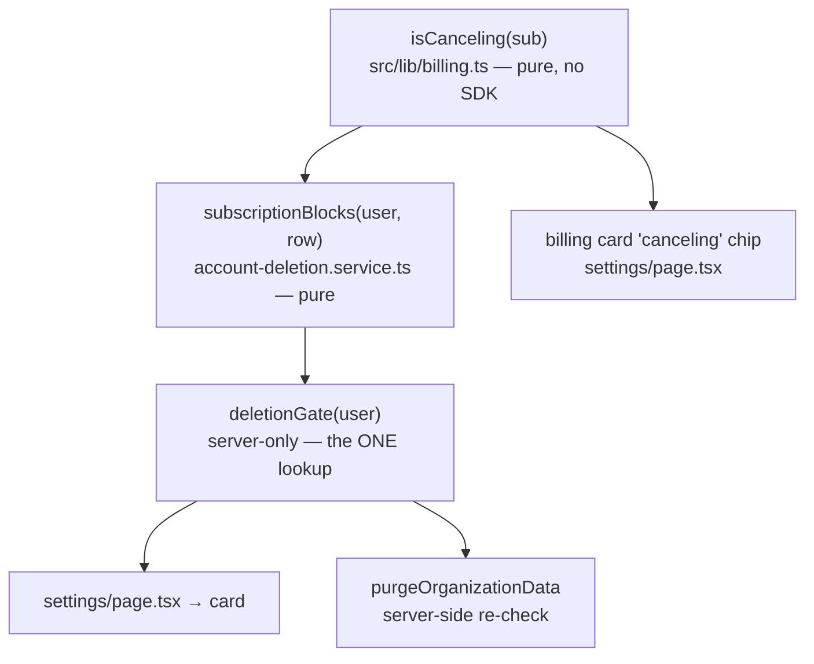

# Account Deletion with a Canceling Subscription — let them out

**Branch:** `feature/account-deletion-canceling-subscription` · **Version:** 0.9.36 (patch, 0.9.x lock)
**Spec:** `context/features/account-deletion-canceling-subscription-spec.md` (authority)
**Date:** 2026-08-31 · **No migration, no schema change, no new dependency, no new route.**

---

## 1. The bug, in one sentence

`subscriptionBlocks` asked *"is there a subscription?"* when the thing that justifies blocking a
deletion is *"will it bill again?"*. Those two questions coincide right up until someone cancels.

An admin who started the 14-day Pro trial could not delete their account. The card told them to
cancel the subscription first; they cancelled in the Stripe Portal, came back — and the Delete
button was still gone. **For up to 14 days on a trial, up to a year on a yearly plan.**

The reason is that cancelling does not change the projection. Stripe fires
`customer.subscription.updated` with the status **still `trialing`** (or **still `active`** on a paid
plan) and merely sets a cancel date. `projectEntitlement` therefore keeps `users.isPro` true and
`stripeSubscriptionId` set. Only `customer.subscription.deleted`, at period end, unblocked anything.

So the card's instruction was not just unhelpful, it was **false**: cancelling changed nothing.

---

## 2. The rule — one derivation, three readers



### `isCanceling` — reads **both** fields, and that is the point

```ts
export function isCanceling(sub: {
  cancelAtPeriodEnd: boolean | null;
  cancelAt: Date | null;
}): boolean {
  return Boolean(sub.cancelAtPeriodEnd || sub.cancelAt);
}
```

Stripe does **not** raise `cancelAtPeriodEnd` on a *trialing* subscription — it sets `cancelAt` to
the trial end instead. This was found by a real pass through Stripe on 2026-08-06 and confirmed
again in this feature's live run: after a Portal cancel the row read
`cancelAtPeriodEnd: false, cancelAt: 2026-09-14`. **A boolean-only check would have kept the account
locked out.** A unit test pins the `cancelAt`-only case by name.

It lives in `billing.ts`, already "the one place a Stripe status is interpreted", beside
`isProStatus`. `settings/page.tsx` switched its billing-card `"canceling"` derivation to it, so the
amber chip and the deletion gate can never disagree (invariant #5).

### `subscriptionBlocks` — the signature widens; a missing row **blocks**

```ts
if (!user.isPro || !user.stripeSubscriptionId) return false;
if (!subscription) return true;   // ← conservative on purpose
return !isCanceling(subscription);
```

A missing row is the window between returning from Checkout and the webhook landing. We do not know
whether it will bill, so we assume it will. Letting a deletion through on unknown state means
leaving Stripe billing an account that no longer exists.

### `deletionGate` — keyed on `users.stripeSubscriptionId`, **never** `referenceId` + `periodEnd DESC`

```ts
export type DeletionGate =
  | { kind: "open" }
  | { kind: "blocked" }
  | { kind: "ending"; endsAt: Date | null };
```

- `!isPro || !stripeSubscriptionId` → `open`, **with no query at all**.
- Otherwise one `subscription.findFirst({ where: { stripeSubscriptionId } })`.

**Why the lookup key matters.** `referenceId` is deliberately non-unique — a customer who cancels
and resubscribes gets a second row. Ordering those by `periodEnd DESC` can select a *different row*
than the one the user actually holds. A cancelled yearly (ending in 11 months) beside a new monthly
(ending in 1 month) makes `periodEnd DESC` return the **cancelled** one, so the card would offer a
Delete button that the server then refuses — and the emailed link would burn on `subscriptionActive`.
`users.stripeSubscriptionId` is the pointer `projectEntitlement` writes from the newest event; it is
the truth. This is proven live in §5, step 10.

`endsAt` is `cancelAt ?? periodEnd`, and is **nullable** — a null must render a sentence without a
date, never crash and never invent one.

Both readers call the gate: the page for the card, `purgeOrganizationData` for the re-check. The
card is an explanation; **the re-check is the boundary.**

---

## 3. Four card states

`AccountManagementCard` takes `deletion: DeletionState` instead of a boolean. The type comes across
via **`import type`** — erased at compile time, so the service's `server-only` guard never fires.

| State | Condition | Renders |
| --- | --- | --- |
| `pending` | an unexpired `delete-account-*` row for this user | *Brisanje zatraženo* + **Odustani od brisanja**. **No Delete button** — one request at a time |
| `blocked` | Pro, subscription will bill again | Notice + *Upravljanje naplatom* |
| `ending` | Pro, subscription set to cancel | **Delete button** + one sentence: ends on `{date}`, deleting forfeits the remainder, no refund. **The modal repeats it** |
| `open` | no blocking subscription | Delete button → modal → email |

**`pending` outranks `blocked` on purpose.** `/delete-user` (the request) does not run the gate —
only the callback does — so a request made while `ending` survives a Portal reactivation. The card
shows what is pending and offers to revoke it; clicking the link would burn on `subscriptionActive`
anyway.

The forfeit sentence appears on the card **and inside the modal**, from one catalog key: the
consequence belongs where the decision is made, not only where it is offered.

---

## 4. Cancelling a pending request

Before this, the only way to change your mind was to not click the link and wait 24 hours — and
nothing on `/settings` even showed that something was pending.

```ts
export const DELETE_TOKEN_PREFIX = "delete-account-";
hasPendingDeletionRequest(userId): Promise<boolean>   // + expiresAt > now
revokeDeletionRequests(userId): Promise<number>        // no expiresAt clause
```

- **`value = userId` is in both WHERE clauses.** The `verifications` table has no foreign key, so
  the WHERE clause *is* the only ownership that exists — a foreign user's request is unexpressible,
  not guarded against.
- **The prefix filter is load-bearing.** `reset-password:*` rows also carry `value = userId`.
  Revoking a deletion request must not kill a pending password reset.
- Expired rows are **not** filtered on delete — sweeping a dead token costs nothing.

`cancelDeletionRequest()` (server action) takes **no input**, so no zod, and is **not rate-limited**:
it is session-gated and destroys nothing but the caller's own pending link. The id comes from the
session's email, never an argument. On success the card toasts and calls `router.refresh()`, because
the pending state is server-derived.

### ⚠ The one real ceiling — needs a human on every `better-auth` bump

`"delete-account-"` is read off BetterAuth's **internal** `update-user.mjs` (lines 321 write / 390
consume), not a public export. A rename in a future version makes `hasPendingDeletionRequest` return
false forever **and** makes `revokeDeletionRequests` delete nothing — so *Odustani od brisanja* would
toast success while the emailed link stays live. Silent, and it fails in the safe-looking direction.

**Mitigation: re-run §10 step 6 (cancel → link renders `invalidToken`) on every `better-auth` bump.**
The constant carries a comment naming the file, lines and version it was verified against.

> The spec cited **1.6.26**. The installed version is **1.7.2** — re-read and re-verified during this
> feature; the prefix is unchanged, and step 6 passed on 1.7.2. The comment says 1.7.2.

---

## 5. Live verification — 12 steps, all pass

Real Stripe test mode + CLI 1.45.1 (`stripe listen`), Neon **development** branch, throwaway
org/admin, `BILLING_ENABLED` flipped true and restored byte-identically afterwards.

| Step | Evidence |
| --- | --- |
| 1–2 | Free → Delete button. Trial via real Checkout (**no card requested** — `payment_method_collection: "if_required"`) → `blocked` |
| **3** | **The bug, fixed.** Portal cancel → SQL: `isPro` **true**, status **`trialing`**, `cancelAtPeriodEnd` **false**, `cancelAt` set. Card showed Delete + forfeit sentence. Billing card and deletion card printed the **same date and verdict** |
| 4–5 | Modal renders the sentence between body and export; `DELETE` gate intact → exactly one token row, `value` = user id, **24.0 h** TTL. Reload → `pending`, Delete hidden |
| **6** | Cancel → row gone → emailed link → **`invalidToken`**, account intact. *(The §6.3 re-verification, on 1.7.2.)* |
| 7–8 | Full deletion → user/org/election/voters/votes/sessions all **0**. Reactivating before clicking → **`subscriptionActive`**, nothing deleted, link burnt |
| 9 (D2) | Paid shape (`active` + `cancelAtPeriodEnd`, `cancelAt` null) → `ending`, date from **`periodEnd`** — exercises `cancelAt ?? periodEnd` |
| **10** | **Two-row case.** SQL proved the queries disagree: `periodEnd DESC` → `ending`, gate → `blocked`. The card followed the **gate** |
| 11 | `/en` complete, same UTC date, no Croatian leftovers |
| D4 | Cancelled the real subscription → `customer.subscription.deleted` → **200**, row → `canceled`, users table untouched (`updateMany` 0 rows) |

Teardown SQL-proven back to baseline. ⚠ The dev DB carries a **SCHEDULED election with a past
`startsAt`** — pinging the cron sweep would send real invitations. It was never pinged; zero emails
sent.

### Tests

**719 passing** (39 files, +23). All six §9 mutations turn a **named** test red — including
`isCanceling` dropping `cancelAt`, the missing-row-blocks case, and the gate looking up by
`referenceId`. The mutation runner asserts the search string was **found** before writing: this repo
has twice had a non-applied mutation read as "not caught", because multi-line patterns written with
`\n` never match CRLF files.

---

## 6. What this deliberately does NOT do

Recorded in `future-updates-spec.md` (Profile & Settings → Account deletion), not built:

- **Scheduled deletion at subscription end** — a column, a trigger, a headless purge. Under the
  shipped rule an admin can cancel and delete immediately, so nothing is blocked by its absence.
- **Partial refunds** — a manual Stripe-dashboard act at €9/month. Revisit at the €49/€99 tiers.
- **Our code cancelling the Stripe subscription.** After deletion the subscription dangles until
  Stripe's own `deleted` webhook lands on a deleted org and updates 0 rows — proven above. If the
  dangling period ever matters, the upgrade is a post-commit best-effort call in its own `try/catch`,
  **never before the commit**: a Stripe outage must not fail an erasure that is otherwise complete.
- **A checkbox-per-consequence list.** The typed `DELETE` is the friction.

---

## 7. ⚠ Unrelated blocker found during verification — L3

**Email/password sign-in is broken on `main`.** Google OAuth is unaffected. It is **not** caused by
this feature, which touches no auth code.

`fb43c1a` (the npm-audit fix) bumped **better-auth 1.6.26 → 1.7.2**. 1.7.2's sign-in handler selects
the credential account on three conditions including **`account.issuer === "local:credential"`** —
and the `Account` model has **no `issuer` column** (confirmed in `schema.prisma` and the live
`information_schema`). The field is `undefined` on every row, the match never succeeds, and a correct
password against a valid scrypt hash returns 401 `"User not found"`.

It fails as a **JS-side filter**, not a Prisma error, so there is no 500 and nothing in the logs but
an ordinary 401 — which is why it reads as "the seeded password drifted".

Full trace and fix sketch: `future-updates-spec.md` → **Auth → L3**. Fix belongs on
`fix/better-auth-issuer-column` (column + migration + backfill).

---

## 8. Files touched

| File | Change |
| --- | --- |
| `src/lib/billing.ts` (+ test) | `isCanceling` |
| `src/lib/services/account-deletion.service.ts` (+ test) | `subscriptionBlocks` 2nd param · `deletionGate` · `DeletionGate`/`DeletionState` · `DELETE_TOKEN_PREFIX` · `hasPendingDeletionRequest` · `revokeDeletionRequests` · re-check via the gate |
| `src/actions/settings.ts` (+ test) | `cancelDeletionRequest` |
| `src/app/[locale]/(app)/settings/page.tsx` | billing chip via `isCanceling` · `id` on the user select · gate + pending → `deletion` prop |
| `src/components/settings/account-management-card.tsx` | four states · Cancel button · forfeit sentence in card and modal |
| `messages/{hr,en}.json` | 8 keys, round-trip guarded (11-line diffs) |

`sharedOrganization`, the email second factor, the `DELETE` gate, the `deleteUser` hooks and
`projectEntitlement` are **not** edited.
