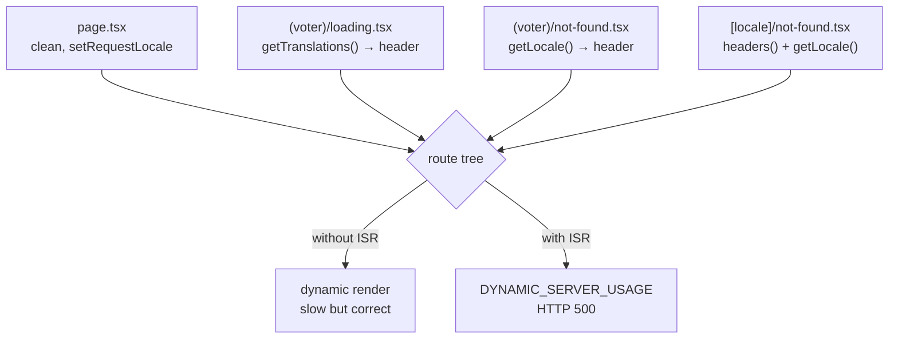

# Caching Strategy — the public results page, and the three premises that were wrong

**Branch:** `feature/caching-strategy` · **Version:** 0.9.38 (patch, 0.9.x lock)
**Spec:** `context/features/caching-strategy-spec.md` · **Date:** 2026-08-31
**Stack at time of writing:** Next.js **16.3.3** (Turbopack) · next-intl **4.14.1** · React 19
**Behaviour change:** the public results page is now CDN/ISR-cacheable. Three route-boundary files
became Client Components. No schema change, no migration, no new dependency, no server action.

> Read §3 before touching anything under `src/app/[locale]/`. It is the general rule this feature
> exists because of, and it is not obvious from the Next.js docs.

---

## 1. What existed before

Nothing was cached. Verified by inspection and then by measurement: every page in the application
rendered on demand, on every request, including the marketing landing page and the public results
page — the latter serving a tally that can never change again.

That is *mostly correct*. The whole `(app)` tree is per-tenant and session-derived and **must** stay
dynamic. The gap was that one genuinely cacheable public surface paid full dynamic cost, and nothing
in the repo recorded that as a decision.

**What shipped:** `/results/[id]` is now ISR-cached with a 1-hour TTL. A published tally is served
from cache in ~5 ms instead of ~70–1850 ms, and the Neon compute is not woken to do it.

| Surface | Before | After |
| --- | --- | --- |
| `/{locale}/results/[id]` | dynamic, `no-store`, Postgres per request | `s-maxage=3600, stale-while-revalidate=…`, MISS→HIT |
| everything under `(app)` | dynamic | **unchanged, deliberately** — deny list, §7 |
| export routes / PDF | `no-store` | **unchanged** — they carry PII |

---

## 2. Three spec premises that measurement overturned

The spec was written carefully and was still wrong in three places. All three were found by running
the thing, never by reading it. Recorded here so nobody re-derives them.

### 2.1 `export const revalidate` alone does nothing

The spec's headline change was one line. Measured on a production server, that line produced:

```
Cache-Control: private, no-cache, no-store, max-age=0, must-revalidate
```

…and no cache header at all. Both requests hit Postgres.

**In Next 16, a route with a dynamic segment needs `generateStaticParams` to enter the ISR path at
all.** Proven with a probe pair — identical trivial pages, one with `generateStaticParams` and one
without:

| Probe | `generateStaticParams` | Result |
| --- | --- | --- |
| A | absent | never cached, `no-store` |
| B | `[{ id: "seed" }]` | cached — **including for ids never listed** (`/notseeded` → MISS, then HIT) |

So the shipped page exports **both**, and the empty array is load-bearing:

```ts
export const revalidate = 3600;

export function generateStaticParams(): { id: string }[] {
  return [];   // empty ≠ pointless: its PRESENCE is what enables ISR
}
```

An empty `generateStaticParams` reads exactly like dead code. It is the first thing a tidy reviewer
deletes, and deleting it silently reverts the whole feature with no error anywhere. That is why
there is a test asserting it exists (§5).

### 2.2 ⚠ The combination that takes the page down

`revalidate` + `generateStaticParams`, **without** first cleaning the route tree, returns
**HTTP 500 `DYNAMIC_SERVER_USAGE` on every request** — published tally and hidden screen alike.

Opting into ISR changes a dynamic API from *tolerated* to *fatal*. Without ISR a `headers()` read
anywhere in the tree merely forces dynamic rendering: slow, correct. With ISR it throws.

This is the dangerous half of §2.1: a developer who reads "add `generateStaticParams` to enable
caching" and does exactly that, on any route whose group has a header-reading boundary, takes that
route down. **Check §3 first, every time.**

### 2.3 The static-render investigation was not a separate concern

The spec assigned the public-results cache and the "why is the marketing page not static"
investigation to two different branches, on the assumption they were independent. They are not —
the cache cannot ship without cleaning the shared boundary files. Scope was widened deliberately,
with the decision recorded.

The spec also named the right *file* but the wrong *mechanism*, and its suggested experiment
therefore returns a **false negative**: it says to replace the explicit `headers()` call in
`[locale]/not-found.tsx` with a constant and rebuild. Doing exactly that changed nothing, because
the same file's `getLocale()` / `getTranslations()` read the same header underneath.

---

## 3. The general rule — route boundaries poison the tree

**A route-boundary file (`loading.tsx`, `not-found.tsx`, `error.tsx`, `template.tsx`) renders inside
the tree of every page beneath it.** A dynamic API in a boundary opts out the entire subtree — not
just the boundary.

And boundaries receive **no `params`**. So they have no locale to hand to next-intl, and
`getTranslations()` / `getLocale()` fall back to reading the `x-next-intl-locale` request header.
That is a `headers()` read with no `headers()` in sight.



**The fix pattern:** make the boundary a Client Component and use the `next-intl` *client* hooks.
`NextIntlClientProvider` already wraps everything from `[locale]/layout.tsx`, and that layout calls
`setRequestLocale`, so `useLocale()` / `useTranslations()` are static-safe.

```tsx
"use client";
import { useLocale, useTranslations } from "next-intl";
```

Three files were converted: `[locale]/not-found.tsx`, `(voter)/not-found.tsx`, `(voter)/loading.tsx`.
All three carry a comment saying why, because "make this a server component again" is an
attractive-looking cleanup.

**`[locale]/not-found.tsx` also lost its host detection**, and did not need a replacement:
`/{locale}` is already correct on both hosts — the apex serves the marketing landing, and the
dashboard host 307s it to `/{locale}/home` (`proxy.ts`, "Host root"). One extra hop, same
destinations, zero request reads.

### ⚠ `ƒ` in the build table proves nothing

For a route with a dynamic segment, `next build` prints `ƒ (Dynamic)` **whether or not it caches**.
A probe with a trivial body and `revalidate` showed `ƒ` while genuinely serving MISS→HIT at runtime.

**Only response headers settle it.** `x-nextjs-cache: HIT` + `s-maxage` on `next start`, or
`x-vercel-cache` on the deploy. Do not read the build table as evidence either way.

---

## 4. The constraint that shaped the design — no existence oracle

`public-results-page-spec.md` requires four distinct rejections — non-existent id, `resultsVisible =
false`, DRAFT/SCHEDULED, and a sealed in-progress tally — to render **one byte-identical screen at
HTTP 200**. A 404 for "no such election" beside a 200 for "exists but unpublished" *is* an oracle.

**A cache can rebuild that oracle out of metadata even when the body is identical:** `HIT` vs `MISS`,
an `Age` header that only appears for real elections, or a response-time gap.

This is the single reason the design uses route-segment ISR and **not** a Redis read-through cache.
Route-segment caching keys on the **path** and has no idea which branch rendered the page, so both
branches cache on identical terms. Oracle-safety is **structural**, not a rule someone has to
remember. A Redis cache keyed on "published elections only" would be faster to write and would
reintroduce the oracle on its first line.

Measured across every rejection type plus two garbage ids:

| Case | Signature | Body |
| --- | --- | --- |
| DRAFT · SCHEDULED · ACTIVE-hidden · CLOSED-hidden · ARCHIVED-hidden | MISS → HIT → HIT | **92 597 B** |
| 2 × garbage id | MISS → HIT → HIT | **92 597 B** |

Identical `Cache-Control`, no `Age`, cached hits 4.5–9.5 ms with no separation between "exists" and
"does not exist".

**Pre-existing, not introduced here:** on the *uncached* first request an existing row takes
~80–100 ms versus ~46 ms for a garbage id — a DB round trip that finds a row versus one that does
not. Caching **reduces** this exposure, since everything converges to ~5 ms after the first hit.
Recorded, not fixed.

---

## 5. Why `generateStaticParams` returns `[]` and not a sentinel

A sentinel id looks like free hardening: Next tries to prerender it at build, hits any dynamic API,
and **degrades the route to dynamic instead of 500ing**. Confirmed — `●` becomes `ƒ`, runtime 200.

It is not free. Prerendering a path runs the page's **DB query at build time**:

| | `[]` (shipped) | `[{ id: "…" }]` sentinel |
| --- | --- | --- |
| Boundary regresses later | **HTTP 500** on a public page | 200, uncached — degrades |
| Deploy ↔ DB coupling | none | **build FAILS if the DB is unreachable** |
| Build touches the DB | no | yes — one query per locale, wakes Neon |

The middle row was proven by building with a dead `DATABASE_URL`: `Export encountered an error …
exiting the build`. That trades a *conditional future* 500 for a *permanent* deploy-time dependency
on database availability — and it undoes the scale-to-zero work `sweep-gate.ts` exists to protect.
**Kept `[]`; added a guard instead.**

### The guard — `src/lib/static-route-boundaries.test.ts`

The 500 is invisible to every gate this project runs: `tsc` and `lint` cannot see it, the build
labels the route `●` and passes, and CI does not run a build. The route is public. So the alarm has
to be a test.

It is a contract test over file **text**, the same pattern as `better-auth-schema.test.ts`, and it
derives the boundary list **from the filesystem** the way `dashboard-paths.test.ts` does — so a
future `(voter)/error.tsx` falls under the rule automatically. It asserts:

1. no boundary in the ISR route's tree imports `next/headers` or `next-intl/server`;
2. the page still exports **both** `revalidate` and `generateStaticParams`.

**Mutation-checked, 4/4 caught by named tests:** reverting either 404 boundary, reverting
`loading.tsx`, deleting either export.

⚠ **Known gap, by design.** The guard covers *boundary* files. A `headers()` added deeper in the
page's component tree (e.g. `public-results.tsx`) would still 500 and is not caught. Components
there may legitimately use `next-intl/server` — the page calls `setRequestLocale` — so the rule
genuinely differs by file kind, and a blanket ban would be wrong.

---

## 6. What is still latent

Four boundary files still read headers. None is a live hazard today, because none of their routes
has ISR — but each arms the moment someone adds `generateStaticParams` there.

| File | Group | Risk |
| --- | --- | --- |
| `(app)/loading.tsx` · `(app)/not-found.tsx` | `(app)` | **Low.** The group is on the caching deny list and must stay dynamic. |
| `(auth)/loading.tsx` | `(auth)` | Low. Session funnel, never cacheable. |
| `(marketing)/loading.tsx` | `(marketing)` | **This is the remaining blocker on making the marketing page static.** |

That last row is a handover, not a to-do for this branch: the marketing page stayed dynamic after
the 404 boundaries were fixed, and `(marketing)/loading.tsx` is byte-identical in pattern to the
`(voter)` one fixed here. Converting it is the next thing to try, on its own branch, with its own
browser pass.

---

## 7. What must never be cached

Normative. Caching any of these is a defect, not an optimization.

| Surface | Why |
| --- | --- |
| Everything under `(app)` | Per-tenant, session-derived. Dynamic **by construction** — `requireSession()` reads headers. That is a safety property, not an accident. |
| Any `requireSession()` / `resolveEntitlement()` read | `isPro` flips via the Stripe webhook. A cached entitlement is a paying customer seeing Free. |
| Voter roster · org export · results CSV | PII. `no-store` is already correct. |
| Report PDF | Carries a full tally. The R2 object is already the cache; the HTTP response stays `no-store`. |
| `/vote/[token]` | Token state changes the instant a ballot is cast. A cached "ready to vote" screen after the vote is a correctness bug in the voting path. |
| `/results/[id]` while ACTIVE | Numbers move. It is cached only under the uniform per-path rule, never as a "published" entry. |
| Webhooks · cron route | Mutations. |

---

## 8. Verification, and how to repeat it

**Never verify caching on `next dev`.** Turbopack does not apply ISR the way production does, so a
dev-server observation proves nothing either way.

```bash
# 1. stop the dev server FIRST — a build clobbers the .next it is serving from
#    (TaskStop has repeatedly left a zombie holding the port)
Get-NetTCPConnection -LocalPort 3000 -State Listen   # kill the owning PID
rm -rf .next && npm run build

# 2. run the production server against the DEVELOPMENT database
set -a; source <(grep -E '^(DATABASE_URL|DIRECT_URL)=' .env.development); set +a
npx next start -p 3000

# 3. the only evidence that counts — same URL twice
curl -s -o /dev/null -D - http://127.0.0.1:3000/hr/results/<id> | grep -i 'x-nextjs-cache\|cache-control'
```

Evidence recorded for this branch:

| Claim | Result |
| --- | --- |
| Cached | `MISS → HIT`, `s-maxage=3600, stale-while-revalidate=31532400`; hits ~5–10 ms vs 70–1850 ms cold |
| No oracle | 5 hidden statuses + 2 garbage ids → all **92 597 B**, identical signature, no timing separation |
| Deny list uncached | `/hr/home`, `/hr/settings`, org export, voter export → 307, no cache header |
| 404 boundaries render | Browser pass hr + en: correct copy, locale-aware href, voter chrome + voter note intact, **0 console errors** |
| No 500s | `grep -c DYNAMIC_SERVER_USAGE` on the server log → **0** |
| Gates | `lint` 0 errors · `tsc --noEmit` 0 · **730/730 tests** (41 files) · build clean |

---

## 9. Invalidation

The only staleness that matters is the **close transition**: a published election whose window ends
flips from the hidden screen to the tally, and the TTL bounds how late that is.

**Accepted for launch: the TTL.** One hour, matching `SWEEP_GATE_TTL_SECONDS` and the same invariant
`sweep-gate.ts` already ships under — *late ≤ TTL, never forever*. Zero code.

If it ever annoys anyone, the prompt version is `revalidatePath` at the two places an election
closes (`closeElection` and the cron sweep's close pass) — and it **must fail open**, exactly as
`clearSweepGate` does. A lost invalidation is the TTL-bounded case; a failed close is not.

Nothing else needs invalidating: once an election is closed and published, its page is immutable.

---

## 10. Follow-ups

- **Amend `caching-strategy-spec.md`** — §6 is two exports not one; §7 is a hard prerequisite, not a
  parallel branch; and its suggested `not-found.tsx` experiment yields a false negative.
- **Marketing static render** — its own branch; start at `(marketing)/loading.tsx` (§6).
- **`/results/[id]` is still unrated.** The rate limiter is the proper bound on cache-fill cost from
  guessed ids (each mints a ~1 KB entry of identical markup; the platform evicts, so this is storage
  churn, not a leak). Separate branch.
- **Image optimizer** — `next.config.ts` still has no `images` config, so four surfaces render remote
  images with a plain ``. Recorded and deferred; needs its own browser pass.
